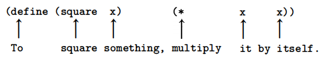
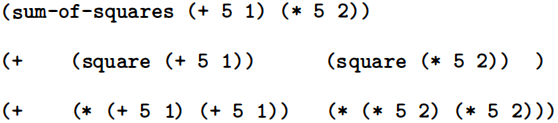
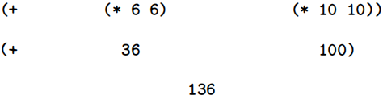
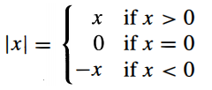
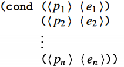
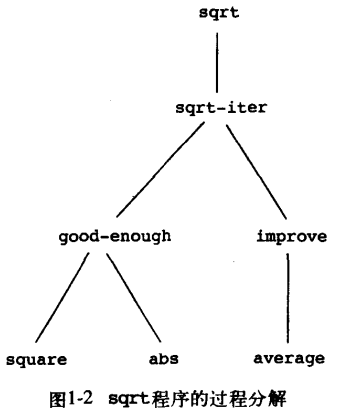

# 1.1 编程要素(The Elements of Programming)

一种强大的编程语言不仅仅是一种指示计算机执行任务的方法。

该语言还充当一个框架，我们在其中组织我们关于进程的ideas。

因此，当我们描述一种语言时，我们应该特别注意这种语言提供的将简单的ideas结合起来形成更复杂的ideas的方法。

每种强大的语言都有三种实现这一目标的机制：

- 原始表达式，代表语言关注的最简单实体，
- 组合手段，通过这种手段，由较简单的元素组成复合元素，以及
- 抽象的手段，通过这种手段，复合元素可以被命名并作为单位进行操作。

在编程中，我们处理两种元素：过程和数据。(稍后我们会发现，它们实际上并不是那么明显不同。)。非正式地说，数据是我们想要操纵的“东西”，而过程是对操纵数据的规则的描述。

因此，任何强大的编程语言都应该能够描述原始数据和原始过程，并且应该有组合和抽象过程和数据的方法。

在本章中，我们将仅处理简单的数值数据，以便我们可以专注于构建过程的规则。[^4]在以后的章节中，我们将看到这些相同的规则也允许我们构建处理复合数据的过程。

## 1.1.1 表达式（Expressions）

入门编程的一个简单方法是研究一些典型的与Lisp Scheme方言的解释器的互动（interactions）。想想你坐在一台计算机的终端前。你输入了一个表达式（expression），解释器通过显示其对该表达式*求值（evaluating）*的结果来响应（responds）。

> 解释器有其它形式的响应。

你可能输入的一种原始的表达式是一个数字。（更准确地说，您键入的表达式是由代表10进制数字的数字码（numeral）组成的）。

> Numerals are written symbols used to represent numbers.
> 数字码是用于表示数字的书面符号。

如果你给Lisp一个数字
`486`
解释将会通过打印[^5]
*486*
来回应。

[^5]: 整本书中，当我们希望强调用户键入的输入和解释器打印的回应之间的差异时，就用斜体的字符显示后者。


代表数字的表达式可以和一个代表原始过程（例如 +或 *）的表达式组合，以构成一个，代表过程对那些数值的应用的，复和的表达式。例如：

`(+ 137 349)`
*486*

`(- 1000 334)`
*666*

`(* 5 99)`
*494*

`(/ 10 5) `
*2*

`(+ 2.7 10)`
*12.7*

像这些，为了表示过程的应用，通过把表达式列表（a list of expressions）界定在圆括号内而形成的表达式，被称为*组合式（combinations)*。

列表中最左侧的元素被称为*运算符（operator）*，其它的元素被称为*运算对象（operands）*。一个组合式的值通过把运算符指定的过程应用于*实际参数（arguments，是运算对象的值）*来获得。

> operator，也能被翻译成操作符。相应的，operand可以被翻译为操作对象。
>argument是实际参数，parameter是形式参数。

将运算符放在操作数左侧，这个约定称为*前缀表示法(prefix notation)*，一开始可能会有些混乱，因为它明显偏离了惯常的数学约定。然而，前缀表示法有几个优点。其中之一是它可以适用于可能接受任意数量的实参的过程，如以下示例所示
`(+ 21 35 12 7)`
*75*

`(* 25 4 12)`
*1200*
不会出现歧义，因为运算符始终是最左侧的元素，并且整个组合式由圆括号定界。

前缀表示法的第二个优点是，它以一种简单的方式扩展以允许组合被嵌套，即允许组合的元素还是组合：
`(+ (* 3 5) (- 10 6))`
*19*

对于Lisp解释器可以可以求值的表达式，这种嵌套的深度和整体复杂性没有限制（原则上讲）。正是我们人类会被仍然相对简单的表达式所迷惑，例如：
`(+ (* 3 (+ (* 2 4) (+ 3 5))) (+ (- 10 7) 6))`
而解释器很容易将其估计为57。我们可以通过形式编写这样的表达方式来帮助自己

```lisp
(+ (* 3
      (+ (* 2 4) 
         (+ 3 5))) 
   (+ ( - 10 7) 
      6)) 
```

这是一个被称为*“美式打印”(pretty-printing)*的格式风格，每个长的组合式都写成这个风格，以便操作数垂直对齐。由此产生的缩进清楚地显示了表达式的结构。[^6]
[^6]: Lisp系统通常提供了在格式化表达式上帮助用户的功能。特别有用的两个功能，一个是，不论合适开始新的一行都会自动缩进到的美式打印的正确位，一个是在输入右括号时自动加亮显示与之对应的左括号。

即使是特别复杂的表达式，解释器总是在相同的基本循环中操作它：从终端读进一个表达式，求表达式的值，然后打印结果。这种运算模式通常被称为解释器在*读取-求值-打印循环（ read-eval-print loop）*中运行。特别要注意的是，没有必要显式地指示解释器打印表达式的值。[^7]
[^7]: Lisp遵循一种约定，每个表达式都有一个值，这个约定，和有关Lisp是一个低效语言的陈旧说法放在一起，是Alan Perlis的双关语的来源，"Lisp程序员知道一切的值，但是知道无需付出任何代价”。

## 1.1.2 命名和环境（Naming and the Environment）

编程语言的一个关键方面是它提供了使用名称来引用（refer to）计算对象（computational objects）的方式。我们说，名称标识了一个*变量（variable）*，变量的*值（value)*是对象。

在Lisp的方言Scheme中，我们使用 `define`来命名一个事物。输入

```lisp
(define size 2)
```

导致解释器把值2和名字size关联。[^8]
[^8]: 在这本书中，我们不展示解释器对定义求值的回应，因为这是极度依赖于实现的。
一旦名字size被关联到2，我们可以使用名字访问到值2：
`size`
*2*

`(* 5 size)`
*10*

这里有更多的使用 `define`的例子：
`(define pi 3 . 14159)`
`(define radius 10)`
`(* pi (* radius radius))`
*314.159*

`(define circumference (* 2 pi radius))`
`circumference`
*62.8318*

`define`是我们的语言里最简单的抽象手段，它允许我们是用一个简单的名字去引用一个复合运算的结果，例如上面计算出的 `circumference`。一般来说，计算对象可能具有非常复杂的结构，每次我们想要使用它们时，都必须记住并重复它们的细节，这将是非常不方便的。事实上，复杂的程序是通过一步一步地构建越来越复杂的计算对象来构建的。解释器使这种循序渐进的程序构造变得特别方便，因为名称-对象的关联可以在后续交互中增量地（incrementally）创建。这一特性鼓励程序的增量开发和测试，并在很大程度上导致了这样一个事实：一个Lisp程序通常由大量相对简单的过程组成。

应该清楚的是，将值与符号相关联,并在以后才可能检索它们, 意味着解释器必须维护某种内存来跟踪名称-对象对。这种内存被称为*环境（environment）*（更确切地是*全局环境（global environment）*，因为我们以后将看到一个计算可能涉及到许多不同的环境）。[^9]
[^9]: 第3章将会说明，环境的概念是关键的，无论对于理解解释器如何工作，还是实现解释器而言。
## 1.1.3 对组合式求值（Evaluating Combinations）

本章的一个目标，就是把与过程性思维（ thinking procedurally）有关的问题分离出来。作为一个恰当的例子，让我们考虑，在对组合式求值时， 解释器本身遵循一个过程。

为了对一个解释器求值，要做下面的事情：

1. 对该组合式的各个子表达式求值
2. 将过程应用到实际参数，过程就最左子表达式（那个运算符）的值，实际参数是其它子表达式（各个运算符对象）的值。

即使是这个简单的规则，也说明了有关一般的过程的一些重要要点。首先，

观察到，第一步决定了，为了完成对组合式的求值进程，我们必须先在组合式的每个元素上执行求值进程。因此，求值规则实际上（in nature）是*递归的（recursive）*；也就是，作为这个规则的步骤之一，这个规则包括了“调用这个规则本身“这个需求。[^10]

[^10]: 这个求值规则（作为第一步的一部分，我们应该对组合式的最左侧元素求值）可能看起来奇怪，因为在这里只有一个运算符，例如+或*，它们表示的是代表了内置原始过程，例如加法或乘法。后面将看到这一规则是有用的，因为我们还需要处理那些运算符部分也是组合表达式的情况。

请注意，在一个深度嵌套组合式的例子中，递归的概念可以多么简洁地用来表达这个进程，这个进程如果不用递归会被视为相当复杂的。例如，求值
```lisp
（*+(2 (* 4 6))
	 (+3 5 7))
```

要求求值规则被应用到四个不同的组合式。我们可以通过将组合式用一个树的形式表示，来获得这个进程的picture，就像图1.1展示。每个组合式用一个带分支的节点表示，分支对应于源自这个节点的组合式的运算符和各个运算对象。终端节点（不再发出分支的节点）要么代表于是暖夫要么代表数字。用这个树的形式看求值，我们能想象到，全部运算对象的值向上传开（percolate），从终端节点开始，然后在越来越高的层次中组合起来。一般而言，我们将看到递归是一个用来处理层次的树状的对象的非常强大的技术。事实上，求值规则的这个"向上传开值"形式，是一种被称作*树计算（tree accumulation）*的一般进程的示例。

接下来，观察到，第一步的重复应用带我们到了我们需要求值的地方，这个地方不是组合式而是原始的表达式，例如数字码，内置的运算符，或者其它的名字。我们通过规定来处理原始情况：

- 数字码的值就是它们所命名的数字
- 内置运算符的值是执行相应操作的机器指令序列，以及
- 其它名字的值是环境中和那些名字关联的对象。

我们可能把第二个规定当作第三种规定的特例，通过规定例如+和*这些符号也被包括在全局环境中，符号和机器指令序列关联，机器指令序列就是符号的值。要注意的关键点是环境在决定表达式的含义中的角色。一个交互的语言，例如Lisp，如果没有指定任何为符号x（或甚至符号+）提供含义的环境信息，谈论表达式（+ x 1）的值是没有意义的。正如我们将在第3章中看到的，环境的一般概念是提供进行求值的上下文，这个概念将在我们对程序执行的理解中发挥重要作用。

请注意，上面的求职规则里并没有处理定义。例如，求值(define x 3) 并没有把define应用到两个实参（一个符号x的值，另一个是3），因为define的目的，确切地说是给x关联一个值。（就是说，(define x 3)并不是一个组合式）

这个对于一般求值规则的例外被称为特殊形式（special forms）。define是到目前位置我们看到的特殊形式的唯一例子，但是不久我们会遇到其它的。每个特殊形式有它自己的求值规则， 各类表达式组成了编程语言的语法。与大部分其它编程语言对比，Lisp有一个非常简单的语法；也就是说，对各种表达式的求值规则可以被描述为一个简单的通用的规则和一组针对不多特殊形式的特殊规则。[^11]
[^11]: 特殊的句法形式只是方便的可供替代的表层结构，用 Peter Landin创造的一个短语来说，有时被称为语法糖（syntactic sugar），可以用更统一的方式书写。与其它语言的用户相比，通常情况下，Lisp程序员不太关心语法问题。(相比之下，请查看任何Pascal手册，并注意其中有多少内容专门用于语法描述。)。这种对语法的蔑视，部分是由于Lisp的灵活性，这使得更改表层语法变得很容易，部分原因是当程序变得很大和复杂时，许多“方便”的语法结构会使语言变得不那么统一，最终造成的麻烦比它们的价值更多。用艾伦·佩利斯的话说，“语法糖会导致分号的癌症。”

## 1.1.4 复合过程（Compound Procedures）

我们在Lisp中已经确定了一些必须出现在任何编程语言中的元素。

- 数字和算术运算是原始的数据和过程。
- 组合式的嵌套提供了一种组合多个运算的手段。
- 将名称与值相关联的定义提供了有限的抽象手段。

现在我们将要学*过程的定义（procedure definitions）*，一个更强大的抽象技术，一个复合运算被给予一个名字，然后作为一个单元来被引用。

我们从考察如何表示“平方”的idea。我们可能说，“求某个东西的平方，就是用它自身去乘以它自身。“在我们的语言里，这个被表示为
`(define (square x) (* x x))`

我们可以用如下的方式理解这个描述：



我们这就有一个被命名为square的复合过程（compound procedure），这个过程代表了将一个东西乘以它自己的运算。被乘的东西被给了一个局部名字x，x扮演着与自然语言里的代数一样的角色。求值这个定义，创造了这个符合过程，并把这个过程与名字square关联。[^12]

[^12]: 可以观察到，这里有实际上组合了两个不同的操作：我们床在哦了一个过程，我们给它命名为square。完全可能，能够将这两个概念分离开，事实上也非常重要，就是创造一个没有名字的过程，把名字给已经创造出来的过程。我没将在1.3.2节看到如何做这个事。

一个过程定义的通用形式是：

(**define** (⟨*name*⟩ ⟨*formal parameters*⟩)
	⟨*body*⟩)

\<name>是一个符号，在环境中被关联到这个过程定义。[^13]

[^13]: 在整本书中，我们描述表达式的一般性语法时，用尖括号括起的斜体符号（例如 `<name>`）表示表达式中的一些“空位置“。在实际采用这种表达式时就需要填充它们。

\<formal parameters>是一些名字，在这个过程的body中使用这些名字来引用过程的相应的实际参数。

(Body)是一个表达式，在该过程被应用的地方，formal parameters被实际参数替换，该表达式将产生该过程应用的值。[^14]
[^14]: 更一般的情况是，过程体可以是一系列表达式。在这时，解释器按顺序对序列中的每个表达式求值，然后返回最后一个表达式的值作为过程应用的值。
\<name>和\<formal parameters>用圆括号括成一组，就和它们在实际调用所定义的过程一样的写法。

有了定义好的sqaure，现在我们能使用它：
`（square 21）`
*441*

`（square （+ 2 5))`
*49*

`(square (square 3))`
*81*

我们也能在定义其它过程中，把square作为一个构建块使用。例如，x^2^ + y^2^可以被表示为
(+ (square x) ( square y))
我们能简单地定义一个过程 sum-of-squares，给定任意两个数字作为实际参数，产生它们平方的和：

```lisp
(define (sum-of-squares x y)
    (+ (square x) (square y))) 
```

`(sum-af-squares 3 4)`
*25*

现在我们能把sum-of-squares当作一个构建块，进一步去构造其它过程：

```lisp
(define (f a) 
    (sum-of-squares (+ a 1) (* a 2)))
```

`(f 5)`
*136*

复合过程的使用方式与基本过程完全相同。事实上，通过查看上面给出的sum-of-squares的定义，人们无法判断square是内置在解释器中的，如+和*，还是定义为复合过程。

## 1.1.5 过程应用的替代模型（The Substitution Model for Procedure Application）

要对一个运算符是复合过程名字的组合式求值，解释器遵循，与我们在1.1.3中描述的，运算符是原始过程名字的组合式相同的进程。也就是，解释器对组合式的元素求值，应用过程（组合式操作符的值）到实际参数（组合式的运算对象的值）。

我们可以假设应用原始过程到参数的机制是内置在解释器。对于复合过程，应用进程是如下的。

把一个复合进程应用到实际参数上，就是要 在每个形式参数被相应的实际参数替代后，对过程体求值。

为了说明这种计算，让我们最这个组合式求值
`(f 5)`
f是在1.1.4章的过程。我们从提取出f的body开始:
`(sum-of-squares (+ a 1) (* a 2))`
然后我们使用实际参数5代理形式参数a
`(sum-of-squares (+ 5 1) (* 5 2))`

因此，问题规约（reduce）为对一个带有两个运算对象和一个运算符sum-of-squares的组合式的求值。对这个组合式求值涉及到三个子问题。我们必须对其中的运算符求值，以便得到应该被应用的过程，我们必须对所有运算对象求值，以得到实际参数。现在(+ 5 1)产生出6，（* 5 2)产生出10，因此我们一定是应用sum-of-squares过程到6和10。这些值代替代sum-of-square的body中的形式参数x和y，表达式被规约为
`(+ ( square 6) (square 10))`
如果我们使用square的定义，这个表达式被规约为
`(+ (* 6 6) (* 10 10))`
通过乘法规约为
`(+ 36 100)`
最后得到
`136`

我们刚刚描述的进程被称为过程应用的*替代模型（substitution model* for procedure application）。就本章中的被关注的过程而言，它可以被视为确定过程应用的“意义”的一个模型。然而，这里有两点应该被强调：

替代的目的是帮助我们考虑过程应用，不提供解释器实际工作方式的具体描述。典型的解释器不会通过操作过程的文本来替换形式参数的值来对过程应用求值。实际上，“替换”是通过将本地环境用于形式参数来实现的。我们将在第3和4章，当我们详细地考察一个解释器的实现的时候，更完整地讨论这个。

在本书的整个课程中，我们将呈现一系列解释器如何工作的越来越精细的模型，并在第5章中完全实施解释器和编译器。替换模型只是这些模型的第一个——一个用于入门正式思考求值进程的方法。一般来说，在模拟科学和工程中的现象，我们从简单的、不完全的模型开始。随着更细致地考察事物，这些简单的模型变得不合适，必须被进一步精制的模型取代。替换模型也不例外。特别地，当我们在第3章强调带有“可变化的数据”的过程的使用，我们将看到替换模型不行了，必须被一个更复杂的过程引用模型取代。[^15]

[^15]: 尽管替换的思想很简单，但令人吃惊的是，给出代换过程的严格数学定义却异常复杂。问题在于，用作过程中形式参数的名字，可能会与该过程可能应用的那些表达式中的（同样）名字相互混淆。事实上，在逻辑和编程语义学文献中，关于替换的错误定义(erroneous definitions of *substitution*)的历史由来已久。有关替换的详细讨论，请参阅Stoy 1977年。

### 应用序相比正常序（Applicative order versus normal order)

按照1.1.3节给出的求值的描述，解释器首先对运算符和各个运算对象求值，而后将得到的过程应用于得到的实际参数。这并不是执行求值的唯一方式。一个可供替代的评估模型是先不会对运算对象求值，直到它们的值被需要。相反，它首先用运算对象表达式替换形式参数，直到它得到一个只涉及原始运算符的表达式，然后执行求值。如果我们使用这个方法，对下面表达式的求值：
`(f 5)`
将按照下面的扩展的顺序进行

而后是下面的归约：


这给出了与前面求值模型同样的答案，但是进程不同。特别地，对(+5 1)和(5 2)的求值在这里每个都被执行两次，对应于这个表达式的规约
(*x x)
x分别被替换为(+5 1)和(5 2)。

这个可供替代的“完全展开而后规约”的求值方法被称为*正常序求值（normal-order evaluation）*，与之对应的是解释器实际使用的”先求实际参数的值然后应用“的方法，它称为*应用序求值”applications order evaluation*。可以看出，对于，对于那些能使用替换建模（包括本书前两章中的所有过程）并产生合法值的过程，应用正常序和应用序将产生出同样的值。（看练习1.5中一个不合法值的例子，正常序和应用序求值不能给出相同的结果）

Lisp采用应用序求值，部分原因这能通过避免对表达式的重复求值，就像上面的(+ 5 1)和(* 5 2)说明的那样，获得额外的效率。更有重大意义地，当我们离开可以通过替换建模的过程的领域时，正常顺序求值处理起来变得更加复杂。而在另一方面，正常顺序评估也能是一个非常有价值的工具，我们将在第3章和第4章中研究它的一些内在性质。[^16]

[^16]: 第3章将引入*流处理（stream processing）*的概念，这是一种采用了正则序求值的受限形式去处理明显”无限的“数据的方式。在4.2节我们将修改Scheme的解释器，做出一个Scheme的正则序变体。

## 1.1.6 条件表达式和谓词（Conditional Expressions and Predicates）

> predicate：
>
> Noun:
>
> 1. (logic) what is predicated of the subject of a proposition; the  second term in a proposition is predicated of the first term by means of the copula;
>
>    "`Socrates is a man' predicates manhood of Socrates"
> 2. one of the two main constituents of a sentence; the predicate contains the verb and its complements

至此我们能定义的过程的类别表达能力非常有限。

因为我们没有办法进行测试，也没有办法根据测试的结果执行不同的操作。例如，我们还无法定义个计算一个数的绝对值的过程。该过程通过测试数字是正数、负数还是零并根据规则在不同情况下采取不同的操作


这个结构被称为*案例分析（case analysis)*，并且在Lisp中有一种特殊的形式来表示这样一个案例分析。它被称为cond（表示"conditional“)，它像下面这样被使用：

```lisp
(define (abs x) 
    (cond ((> x 0) x)
        ((= x 0) 0) 
        ((< x 0) (- x))))
```

一条条件表达式的一般性形式是


这里首先是 一个cond符号，后面跟着圆括号括起来的，被称作从句（clauses）的表达式对。每个对的第一个表达式是一个*predicate*——也就是，这是一个表达式，它的值被解释为真（ture）或者假（false）。[^17]

[^17]: “解释为真或者假“，意思如下：在Scheme里存在着两个特殊，它们分别用常量#t和#f表示。当解释器检查一个谓词的值时，它将#f解释为假，而将其它值当作true。（因此，提供#t在逻辑上是不必要的，但是它是方便的）在这个书中我们将会使用true和false，令它们分别关联于#t和#f

> 这里的predicate是logic的predicate

条件表达式的求值方式如下：首先<p~1~>被求值，如果它的值是false，那么<p~2~>被求值，如果<p~2~>的值也是false，那么<p~3~>被求值。这个进程持续到一个值是true的谓词被发现，此时解释器就返回相应相应的从句的*序列表达式（consequent expression `<e>`）*的值，作为整个条件表达式的值。如果没有一个`<p>`的值是true，cond的值是未定义的（undefined）。

我么们用术语predicate指返回true或false的过程，也指能求出true或false的表达式。求绝对值的过程abs使用了原始的predicates >、<和=。[^18]

[^18]: abs还用到负号运算符-，这个运算符作用域一个单独的对象时（例如写-x），表示求出其负值。

这些predicate把两个数字当实际参数，分别检查它们第一个数是否大于、小于火等于第二个数，并据此返回true或false。

写绝对值的另一种方式是

```lisp
(define (abs x) 
    (cond ((< x 0) (- x)) 
        (else x)))
```

这能用英语表示“If x is less than zero return -x; otherwise return x.” `else`是一个特殊的符号，可以用在cond的最后一个从句中`<p>`的位置。这样导致，当cond前面所有的从句都被跳过，cond就会返回最后一个从句`<e>`的值作为它的值。事实上，任何总是求出true值的表达式都能用做`<p>`。

这里还有另一种写absolute-value过程的方式:

```lisp
(define (abs x) 
    (if (< x 0) 
        (- x) 
        x))
```

这里采用的是特殊形式 `if`，它是一种首先的条件类型，可以在案例分析中恰好有两个情况时使用。if表达式的一般形式是
(**if** ⟨*predicate*⟩ ⟨*consequent*⟩ ⟨*alternative*⟩)

在求值一个if表达式时，解释器从求表达式的\<predicate>这部分开始。如果\<predicate>求出一个真值，解释器求\<consequent>的值并返回它的值。否则解释器对\<alternative>求值并返回它的值。[^19]

[^19]: if和cond的一个下差异是每个cond子句的\<e>部分可以是一个表达式的序列，如果对应的 `<p>`确定为真，\<e>中的表达式就会顺序地求值，并将最后一个表达式的值作为整个cond的值返回。而if表达式里，\<consequent>和 \<alternative>都只能是单个表达式

除了原始的predicate如<、=和>以外，还有一些逻辑合成运算符(logical composition operations)让我们能够构建复合predicate。最常用的3个是这些：

> 短路操作是重点，即画线部分。

- (and <e~1~> ... <e~n~>)
  解释器按照从左到右的顺序，一次对一个表达式求值。`<u>`如果任何一个\<e>求值为false，那么and表达式的值就是false，并且剩余的\<e>不被求值。`</u>`如果全部\<e>求值为ture，and表达式的值是组后一个\<e>的值。
- (or <e~1~> ... <e~n~>)
  解释器按照从左到右的顺序，一次对一个表达式求值。`<u>`如果任何一个\<e>求值为true，那么值被返回作为or表达式的值，并且剩余的\<e>不被求值。`</u>`如果全部\<e>求值为false，or表达式的值是false。
- (not `<e>`)
  当\<e>求值为false，not表达式的值是真，否则是false。

注意到 `and`和 `or`是特殊形式(special forms)，不是过程，因为子表达式不是必须全部被求值的。`not`是一个普通的过程。

做为食用这些逻辑合成运算符的一个例子，一个数字x位于区间5<x<10，这样一个条件，可以表示为
`(and (> x 5) (< x 10))`
作为另一个例子，我么能定义一个predicate，来检测一个数字是否大于或等于另一个：

```lisp
(define (>= x y) 
    (or(> x y) (= x y)))
```

或者也可以定义为：

```lisp
(define (>= x y) 
    (not (< x y)))
```

**练习1.1** 下面是一系列表达式，通过解释器响应每个表达式而打印出来的结果是什么？假这一系列表达式是按照给出的顺序逐个求值的。

```lisp
10 
(+ 5 3 4) 
(- 9 1) 
(/ 6 2) 
(+ (* 2 4) (- 4 6)) 
(define a 3) 
(define b (+ a 1)) 
(+ a b (* a b)) 
(= a b) 
(if (and (> b a) (< b (* a b))) 
    b
    a) 
(cond ((= a 4) 6) 
    ((= b 4) (+ 6 7 a)) 
    (else 25)) 
(+ 2 (if (> b a) b a)) 
(* (cond ((> a b) a) 
       ((< a b) b) 
       (else -1))
   (+ a 1))
```

**练习1.2** 把下面的表达式翻译为前缀形式。

**练习1.3** 定义一个过程，它以3个数字为参数，返回较大的两个数字的平方和。

**练习1.4** 观察我们的允许组合式的运算符是复合表达式的求值模型。使用这个观察来描述下面过程的行为。

**练习1.5** BenbItdiddle已经发明了一个test，用来确定它正在用的解释器使用应用序还是正常序。它定义了下面两个过程：

```lisp
(define (p) (p))
(define (test x y)
    (if (= x 0)
        0
        y))
```

然后它求值下面的表达式
`(test 0 (p))`

如果解释器采用的是应用序求值，Ben会看到什么？如果解释器用的是正常序求值，它又会看到什么？解释你的答案。（假设特殊形式 `if`的求值规则总是一样的，无论解释器使用正常序还是应用序：predicate表达式先被求值，这个结果决定了是对随之而来的表达式还是对可供替代的表达式求值。

## 1.1.7 实例：采用牛顿法求平方根

过程，就像上面介绍的，很像普通的数学的函数（functions）。它们指定一个由一个或多个参数确定的值。但是数学的函数和计算机的过程有一个重要的不同。过程必须是有效可行的。

作为这一点的一个案例，考虑计算平方根的问题。我们可以定义suqare-root函数为：
$\sqrt x=y, y满足y \geq 0且y^2 = x$
这描述了一个非常合法的数学函数。我们能用它来认识一个数字是否是另一个的平方根，或者推导出一些有关平方根的一般性事实。在另一方面，这个定义没有描述一个过程。事实上，它几乎没告诉我们如何确实地找出一个给定数字的平方根。即使将这个定义用伪Lisp（pseudo-Lisp）重定义也无济于事：

```lisp
(define (sqrt x)
    (the y (and (>= y 0)
                (= (square y) x))))
```

这只是一个回避问题（beg question）。

函数和过程的冲突是 描述事物属性和描述怎么做事的普遍性差异，或者，有时被称为，陈述性的（declarative）知识和命令性（imperative）的知识的差异 的一个反映。在数学中，我们通常关注陈述性的（是什么）描述，而在计算机科学中，我们通常关注命令性（怎样做）描述。[^20]

[^20]: 陈述性的描述和命令性描述有着内在的联系，就像数学和计算机科学有着内在联系一样。举个例子，说一个程序产生的答案是”正确“，就是给出了一个有关该程序性质的说明性语句。存在着大量的研究工作，其目标就是建立起证明程序是正确的的技术。在这一领域中有许多技术性的困难，究其根源，都出自需要在行动性语句（程序是由它们构建起来的）和说明性语句（它们可以用于推导出某些结果）之间转来转去。与之相关的是，当前编程语言设计中的一个重要领域是探索所谓的超高级语言，在这种语言中，人们实际上是按照声明性语句的形式进行编程的。这里的idea是将解释器做的足够复杂，给予它由程序员指定的”是什么“的知识，这样它就能自动地产生出”怎样做“的知识。一般而言这是不能做到的，但这是一个已经取得进步的重要领域。我们将在第4章再次讨论这一idea。

如何计算出平方根呢？最常用的方法是使用牛顿的逐步逼近法。这一方法告诉我们，如果对一个数字x的平方根的值有了一个猜测y，我们可以用过执行一个简单操作去得到一个更好的猜测（它更接近实际的平方根）通过求出y和x/y的平均值。[^21]

[^21]: 这个square-root实际上是牛顿法的一个特例，牛顿法是一种寻找方程的根的通用技术。square-root算法本身是由Heron of Alexandria在公元一世纪提出的。我们将在1.3.4节看到如何用Lisp描述一般性的牛顿法。
例如，我么可以用这种方式去计算2的平方根，假定初始值是1：

| 猜测   | 商（Quotient）  | 平均值      |
| ------ | --------------- | ----------- |
| 1      | 2/1             | (2+1)/2=1.5 |
| 1.5    | 2'/1.5=1.3333   | 1/4167      |
| 1/4167 | 2/1.4167=1.4118 | 1/4142      |
| 1/4142 | ...             |             |

持续这个进程，我们能得到平方根的越来越好的近似值。

现在我们用过程的形式形式化这个进程。开始时，我们有一个被开方数（radicand）（一个要被计算平方根的数字）的值和一个猜测值。如果猜测对于我们的目标来说足够好，我们是就算完了。否则，我们必须用一个改进的猜测重复这个进程。我们写下这个基本策略作为过程：

```lisp
(define ( sqrt-iter guess x) 
(if (good-enough? guess x) 
    guess 
    (sqrt-iter (improve guess x) 
               x)))
```

将猜测和 被开方数和旧猜测的商 求平均，得到一个改进的猜测：

```lisp
(define (improve guess x) 
    (average guess (/ x guess)))
```

其中

```lisp
(define (average x y)
    (/ (+ x y) 2))
```

我们也必须说什么叫“足够好”。下面的做法只是为了说明问题，它确实不是一个很好的检测方法。（参见练习1.7）idea是改进答案直到它足够接近平凡根，使得答案的平方和被开方数的差小于预先决定的容忍值（这里是0.001）：[^22]
[^22]: 通常我们将在predicate名字后跟随一个问号，来帮助我们记住它们是predicate。这是一风格惯例。对于解释器来说，问号也只是一个普通的字符。
```lisp
(define (good-enough? guess x) 
    (< (abs (- ( square guess) x)) 0.001))
```

最后，我们需要一个方式来启动。例如，我们总是能猜测，任何数字的平方根是1：[^23]
[^23]: 观察到这里所用的初始猜测是1.0而不是1.这在许多Lisp实现中不会造成任何不同。然而MIT Scheme区分了精确的证书和十进制数值，两个整数的上产生一个有理数而不是十进制数。例如，用6除10将得到5/3，而用6.0除10.0得到的是1.6666666666666667.（我们会在2.1.1节学到如何在有理数上实现算术运算）。如果我们用1作为squart-root程序的初始猜测，x是一个精确的证书，所有后来在square-root计算中产生的值都将是有理数而不是十进制数值。对有理数和十进制数值的混合运算总是产生十进制数值，所以，开始时使用初始猜测1.0，将迫使随后的所有值是十进制数值。

```lisp
(define (sqrt x)
	(sqrt-iter 1.0 x))
```

如果把这些定义都输入进解释器，我们就可以使用sqrt了，就像我们使用任何过程一样：

`(sqrt 9)`
*3.00009155413138*

`(sqrt (+ 100 37))`
*11.704699917758145*

`(sqrt (+ ( sqrt 2) ( sqrt 3)))`
*1.7739279023207892*

`(square (sqrt 1000))`
*1000.000369924366*

sqrt程序也说明了，到目前为止我们已经介绍的，简单的过程的语言是足够写出任何可以在其它语言（例如C或者Pascal）中写出的数值程序。这好像很让人吃惊，因为在我们的语言当中，我们还没有把任何指挥计算机一遍又一遍做事的迭代的（iterative）（循环looping）结构包括进来，而在另一方面， sqrt-iter演示了如何不用特殊的构造，而使用普通调用过程的能力来完成迭代。[^24]
[^24]: 关心通过过程调用来实现迭代时的效率问题的读者，应该注意1.2.1中对于“尾递归”的谈论。
> 利用递归可以实现迭代。Lisp第一个实现了递归。
> 看到这里可研究研究，写代码中递归写法和迭代写法本质上有什么异同，怎么互相转换。

**练习1.6** Alyssa P. Hacker看不出为什么需要将 `if`提供为一种特殊形式，她问：“为什么我不能直接通过 `cond`来定义一个普通的过程呢？”Alyssa的朋友Eva lu Ator断言确实可以这样做，并定义了if的一个新版本：

```lisp
(define (new-if predicate then-clause else-clause) 
    (cond (predicate then-clause) 
        (else else-clause)))
```

Eva给Alyssa演示它的程序：

(new-if (= 2 3) 0 5)
*5*

(new-if (= 1 1) 0 5)
*0*

Alyssa很高兴地用 `newif`重写了square-root程序：

```lisp
(define ( sqrt-iter guess x) 
    (new-if (good-enough? guess x)
            guess 
            (sqrt-iter (improve guess x) 
                       x)))
```

当Alyssa尝试用这个去计算平方根时会发生什么呢？请解释。

**练习1.7** good-enough?用于计算平方根的测试对于寻找非常小的数字的平方根并不是很有效。此外，在真实的计算机中，算术运算几乎总是以有限的精度执行。这使得我们的测试不适用于非常大的数字。解释这些语句，并举例说明小数字和大数字的测试如何失败。实施good-enough?的另一种策略是观察猜测如何，在一次迭代到下一次迭代中并在变化只占猜测的很小一部分时停止，这个过程中变化的。设计了一个使用这种结束测试的square-root过程。这对小数字和大数字都更有效吗？

**练习1.8** 牛顿的立方根方法是基于这样一个事实：如果y是x的立方根的近似值，则值
$$\frac{x/y^2+2y}{3} $$
给出了更好的近似值。 
使用此公式可实现类似于square-root过程的cube-root过程。(在第1.3.4节中，我们将看到如何将牛顿方法作为这些square-root和cube-root过程的抽象来实现。)

## 1.1.8 过程作为黑盒抽象（Procedure as Block-Box Abstractions）

> 黑盒就是不清楚里面是什么。

`sqrt`是我们提供的由一组相互（mutually）定义的过程定义的进程的第一个示例。注意sqrt-iter的定义是*递归的（recursive）*；也就是说，该过程是根据自身定义的。能够根据自身定义过程，这个idea可能令人不安；这样一个“循环论证的（circular）” 定义到底有什么意义似乎并不清楚，更不用说具体说明一个由计算机执行的明确定义（well-defined）的过程了。

> 相互定义在这里指的是递归。
>
> 循环（circular）
>
> [well-defined](https://ja.wikipedia.org/wiki/Well-defined)，好像是个专业的用于，在某些其它书，比如算法导论，中被翻译为良定义。还得看看wiki。

在1.2节者会这个问题会被更仔细地处理。但是首先，来看看sqrt实例所展示出的一些其它关键点。

可以观察到，计算平方根的问题可以自然地分解为若干子问题：如何判断一个猜测是否足够好，如何改进一个猜测等等。这些任务的每一个都可以通过一个独立的过程完成。整个sqrt程序能被看作一组反映了问题分解为子问题的过程（如图1.2所示）。



分解策略的重要性不是简单的把一个把一个程序划分成了几部分。毕竟，我们能拿来任何大程序，把它划分为几部分——首先10行，再10行，再10行等等。 这题最关的问题是每个过程完成了一个可以清楚标明的（identifiable）任务，这是它们可以在定义其它过程时当作模块来使用。例如，当我们用square来定义good-enough?的过程时，我们能够将square过程视为“黑盒”。

> 这里原文多个了’?‘
>
> For example, when we define the good-enough? procedure in terms of square, we are able to regard the square procedure as a “black box.”

在这时我们不关心过程*如何*计算出其结果，只关注它计算了平方的事实。平方数如何被计算出的细节可以被隐去，以后再考虑。事实上，就good-enough?过程而言，square并不完全是一个过程，而是一个过程的抽象，即所谓的*过程抽象（procedural abstraction）*。在这一抽象级别上，任何能计算出平方的过程都是同样好的。

因此，只考虑它们的返回值，那么下面这两个求平方的过程就是不可区分的。每个都接受一个用数字表示的的实际参数，然后产生那个数字的平方作为值。[^25]
[^25]: 对于这两个过程哪个是一个更高效的实现，还不是很明确。这依赖于所使用的硬件。确实存在这样的机器，那个“明显”的实现是低效的那个。考虑一个机器，它有一些范围很广的对数和反对数表，以某种非常高效的方式存储着。
`(define (square x) (* x x))`
`(define (square x) (exp (double (log x))))`
`(define (double x) (+ x x))`

所以一个过程定义应该能够隐藏细节。过程的用户可能不会自己写过程，但是可能从其他程序员那里作为获得作为黑箱的它。一个用户不应该为了使用过程而需要知道如何实现过程。

## 局部名称

一个不应该影响过程的用户的过程的实现细节是，是实现者为过程的形式参数的名字选择。因此，下面的过程不应该被区分：
`(define (square x) (* x x))`
`(define (square y) (* y y))`

这个原则——过程的含义应该独立于其创建者使用的参数名称——表面上似乎是不言而喻的，但是它的后果是深远的。最简单的后果是，过程的形式参数必须局部于过程的body中，例如，在square-root过程中，我们在good-enough?的定义中用了square：

```lisp
(define (good-enough? guess x)
    (< (abs (- (square guess) x))
       0.001))
```

good-enough?的作者的意图是确定第一个实际参数的平方是否在第二个实际参数的给定容差之内。我们看到good-engouh的作者使用名字guess来引用第一实际参数，使用名字x来引用第二个实际参数。square的实际参数是guess。如果square的作者用x（像上面那样）来访问实际参数，那么我们看到good-enough?的x一定和square里的那个x不同。运行过程square一定不影响被good-enough?使用的x的值，因为在square被计算完后x可能被good-enough?需要。
如果参数不是局部与各自过程的body，那么square中的形式参数x可能与good-enough?中的形式参数混淆，good-enough?的行为会依赖与我们使用的squre的版本。这样，square不会是我们想要的黑箱了。
在过程定义中，一个过程的形式参数有一个非常特别的角色，在这里，形式参数的名字是什么不重要。这样的名字被称为*约束变量（bound variable）*，我们说过程定义*约束（bind）*了它的形式参数。即使一个约束变量在整个过程定义中一起重命名，过程的定义是不变的。[^26]
[^26]: 统一换名的概念实际上也是很微妙的，很难形式地定义好，一些著名的逻辑学家也在这里犯过令人尴尬的错误。
如果一个变量不是约束的，我们说它是*自由的（free）*。一个名字的定义被约束于的那些表达式的集合被称为*作用域（scope）*。在一个过程定义中，被声明为过程的形式参数的约束变量，就以这个过程的body作为它们的作用域。
在上面的good-enough?的定义中，guess和x是绑定变量，但是<、-、abs和square是自由的。good-enough?的含义应该独立于我们对guess和x的名字的选择，只要求它们是distinct and different于<、-、abs和square。（如果我们重命名guess为abs，我们会通过*捕获（capturing）*变量abs来引入一个bug。它会从自由的变为约束的）。good-enough?的含义独立于它的自由变量，然而。good-enough?依赖于个事实（在这个定义之外）：符号abs命名了一个计算数字的绝对值的过程。如果我们在good-enough?的定义中用cos替换abs，good-enough?会计算一个不同的函数。
### 内部定义和块结构（Internal definitions and block structure）

到现在为止我们有一种可用的名称隔离方式：过程的形式参数对于过程的body是局部的。square-root程序说明了我们能控制名字使用的另一个方式。现有的程序由独立的过程组成：

```lisp
(define (sqrt x)
    (sqrt-iter 1.0 x))
(define (sqrt-iter guess x)
    (if (good-enough? guess x)
        guess
(sqrt-iter (improve guess x) x)))
(define (good-enough? guess x)
    (< (abs (- (square guess) x)) 0.001))
(define (improve guess x)
    (average guess (/ x guess)))
```
这个程序的问题是对sqrt的用户最重要的过程只是sqrt。其它的过程（sqrt、good-enough?和improve）只会弄乱它们的mind。它们不能在另一个和square-root程序一起使用的程序中，定义任何其它叫做good-enough?的过程作为这个程序的一部分。因为sqrt需要它。
在由许多独立的程序员一起构造大系统时，这一问题将会特别严重。例如，在构造一个大型的数值过程库，许多数值函数都需要计算出一系列的近似值，因此可能有命名为good-enough?和improve的过程作为辅助过程。我们希望将子过程局部化，将它们隐藏到sqrt里面，以使sqrt能于其它采用逐步逼近的及过程共存，每个都一个它们私有的good-enough?过程。为了让这个成为可能，我们允许一个过程有局部与这个过程的内部定义。例如，在square-root中我们能写：
```lisp
(define (sqrt x)
    (define (good-enough? guess x)
        (< (abs (- (square guess) x)) 0.001))
(define (improve guess x) (average guess (/ x guess)))
(define (sqrt-iter guess x)
    (if (good-enough? guess x)
        guess
        (sqrt-iter (improve guess x) x)))
(sqrt-iter 1.0 x))
```
这种定义的嵌套，称为*块结构（block structure）*，基本上是最简单的名称打包（name-packaging）问题的正确解决方案。但这里潜藏着一个更好的idea。除了将辅助过程的定义放在内部，我们能简化它们。因为x在sqrt的定义中是受约束的，且被定义在sqrt里面的过程sqrt、good-enough?和improve在x的定义域中。因此，没有必要显式地传x给这些过程。相反，我们允许x在内部定义中是自由变量，就像下面展示的。然后，x从调用封闭过程sqrt的实际参数中获得它的值。这个纪律称为*词法作用域（lexical scoping）*。[^27]
> [lexical](https://www.collinsdictionary.com/dictionary/english/lexical) scoping还有另一个名字，叫做 static scoping，也就是静态作用域。
> 一些中文书直接把lexical scoping翻译成静态作用域。
[^27]: 词法作用域要求过程中的自由变量被用来引用封闭过程定义产生的绑定；也就是，它们在过程被定义的环境中被寻找。我们将在第3章，当我们研究环境和解释器的详细行为时，详细地看到这是怎样工作的。
```lisp
(define (sqrt x)
    (define (good-enough? guess)
        (< (abs (- (square guess) x)) 0.001))
    (define (improve guess)
        (average guess (/ x guess)))
    (define (sqrt-iter guess)
        (if (good-enough? guess)
            guess
            (sqrt-iter (improve guess))))
    (sqrt-iter 1.0))
```

我们将广泛使用块结构来帮助我们将大型程序分解为易于处理的碎片。[^28]
[^28]: 嵌入的定义必须放在过程体的开头。如果一个程序中的定义和使用交织在一起，那么管理层不对这个程序的运行后果负责
块结构的想法起源于编程语言ALGOL 60。它出现在大多数高级编程语言中，是帮助组织大型程序构建的重要工具。
